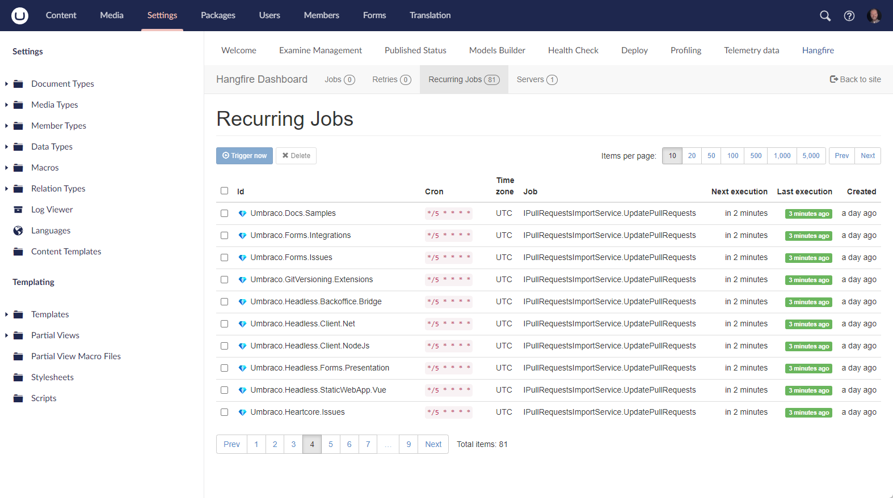

# Cultiv.Hangfire &middot; [](LICENSE) [](https://www.nuget.org/packages/Cultiv.Hangfire/) [](https://twitter.com/intent/follow?screen_name=cultiv)

Hangfire dashboard for Umbraco

This installs Hangfire and a dashboard in Umbraco, the dashboard is secured and is only available for users with access to the Settings section of Umbraco.

After installing this, you can add a `Composer` to start running scheduled tasks, for example:

```csharp
using System.Threading;
using Hangfire;
using Hangfire.Console;
using Hangfire.Server;
using Umbraco.Cms.Core.Composing;
using Umbraco.Cms.Core.DependencyInjection;

namespace MyNamespace
{
    public class Composer : IComposer
    {
        public void Compose(IUmbracoBuilder builder)
        {            
            RecurringJob.AddOrUpdate(() => DoIt(null), Cron.Hourly());
        }
        
        public void DoIt(PerformContext context)
        {
            var progressBar =  context.WriteProgressBar();
            var items = new int[10]{ 2, 4, 6, 8, 10, 12, 14, 16, 18, 20 };

            foreach (var item in items.WithProgress(progressBar, items.Length))
            {
                context.WriteLine($"Number: {item}");
                Thread.Sleep(1000);
            }
        }
    }
}
```

In the Umbraco backoffice it will look a little something like this:

